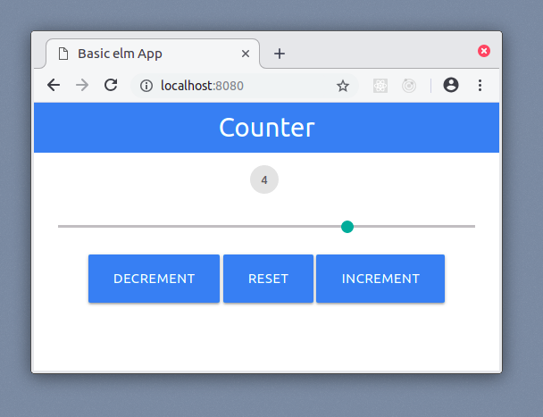
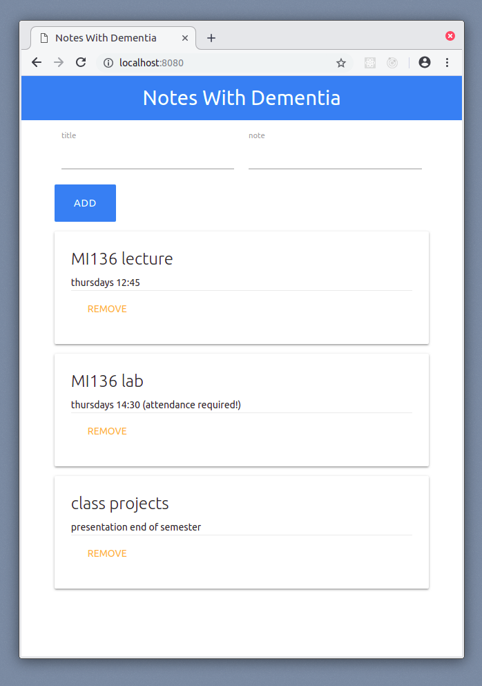

# MI136 Examples

This repo contains the code examples for the MI136 class held in winter semseter
2018 at FH Kiel.

Each example can be found in a separate subfolder.

### Requirements

You will need to install the following tools:

* **Node.js** JavaScript runtime
* **npm** package manager
* **npx** package runner
* **elm** [development tool chain](https://guide.elm-lang.org/install.html)
* **elm-live** [auto refresh build runner](https://github.com/wking-io/elm-live)

### Running Examples:

From an example folder run

```bash
./start
```

to run an example.

**NOTE:** windows users have to run this command in a BASH shell. Use Git BASH for example.

### List of examples:

`/counter`: a very basic elm app that demonstrates the use of state



`/notes-with-dementia`:  a note application that does not store the notes



